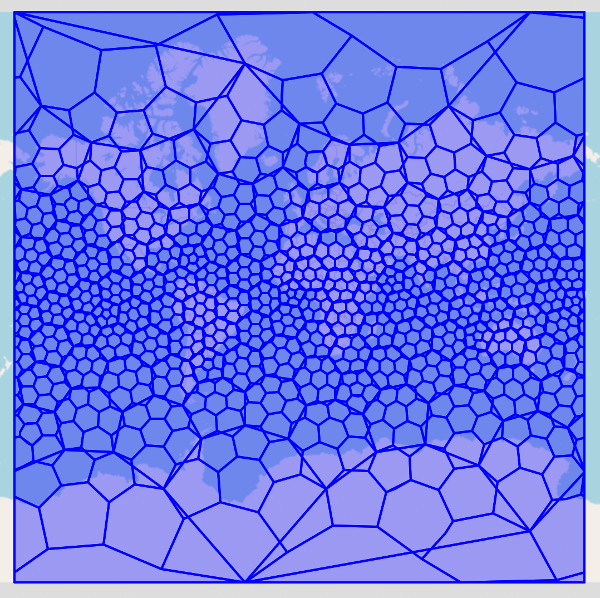
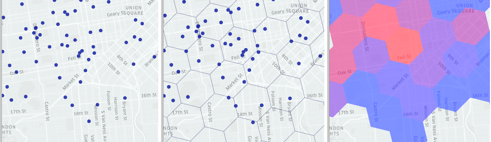

<!-- ABOUT THE PROJECT -->
## About The Project
This project aims to set up PostgreSQL 15.4 with PostGIS and Uber's H3 extension in a Docker container, along with some pre-installed H3 tables.

### Prerequisites

Docker needs to be installed on your machine. You can download Docker from the [official site](https://www.docker.com/products/docker-desktop/)

### Installation

1. Clone the repository
    ```bash
    git clone https://github.com/ConstantineMalykhin/pg_h3.git
    cd pg_h3
    ```

2. Build the Docker Compose
    ```bash
    docker-compose build
    ```

3. Start the Docker Compose
    ```bash
    docker-compose up -d
    ```

Since Docker Compose runs in detached mode, you can connect to PostgreSQL using the credentials provided in the Docker Compose setup:
- POSTGRES_USER: admin
- POSTGRES_PASSWORD: admin
- POSTGRES_DB: postgres

For instance, you can connect to the database using [DBeaver](https://dbeaver.io/).

After connecting to the database, you can see the H3 schema, which already contains a `hex` table with hexagons of resolutions 0 and 1.
<br></br>
<div style="text-align:center;">
  
</div>
<div style="text-align:center;">
  
</div>


To create hexagons with resolutions 2, 3, and so on, run the following SQL code:

  ```sql
  INSERT INTO h3.hex (ix, resolution, geom)
  SELECT h3_cell_to_children(ix) AS ix,
         resolution + 1 AS resolution,
         ST_Multi(h3_cell_to_boundary_geometry(h3_cell_to_children(ix))) AS geom
    FROM h3.hex 
   WHERE resolution IN (SELECT MAX(resolution) FROM h3.hex);
  ```
For more information about Uber's H3, you can visit their website [here](https://h3geo.org/)

<!-- CONTACT -->
## Contact
[![LinkedIn][linkedin-shield]][linkedin-url]

<!-- MARKDOWN LINKS & IMAGES -->
<!-- https://www.markdownguide.org/basic-syntax/#reference-style-links -->
[contributors-shield]: https://img.shields.io/github/contributors/github_username/repo_name.svg?style=for-the-badge
[contributors-url]: https://github.com/ConstantineMalykhin
[linkedin-shield]: https://img.shields.io/badge/-LinkedIn-black.svg?style=for-the-badge&logo=linkedin&colorB=555
[linkedin-url]: https://www.linkedin.com/in/constantinemalykhin/
[product-screenshot]: img/h3.png